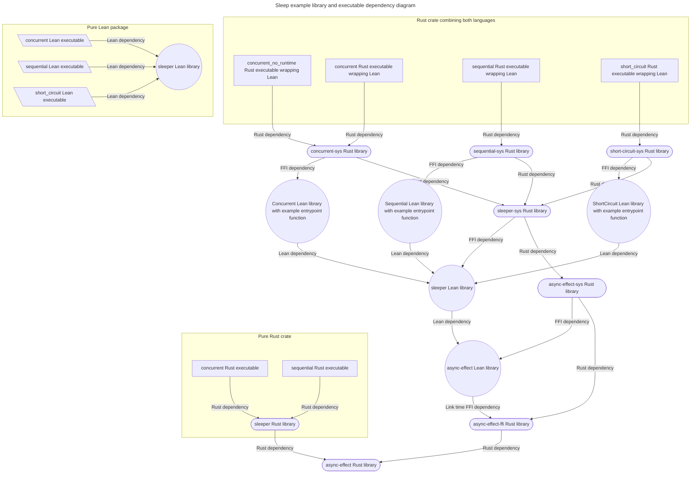

# Asynchronous operations example <!-- omit from toc -->

## Table of contents <!-- omit from toc -->

- [Overview](#overview)
- [Demonstration](#demonstration)
  - [Sequential](#sequential)
    - [Pure Lean sequential example](#pure-lean-sequential-example)
    - [Pure Rust sequential example](#pure-rust-sequential-example)
    - [Combined Lean and Rust sequential example](#combined-lean-and-rust-sequential-example)
  - [Concurrent](#concurrent)
    - [Pure Lean concurrent example](#pure-lean-concurrent-example)
    - [Pure Rust concurrent example](#pure-rust-concurrent-example)
    - [Combined Lean and Rust concurrent example](#combined-lean-and-rust-concurrent-example)
  - [Short circuit](#short-circuit)
    - [Pure Lean short circuit example](#pure-lean-short-circuit-example)
    - [Combined Lean and Rust short circuit example](#combined-lean-and-rust-short-circuit-example)
- [Structure](#structure)
  - [Static versus dynamic linking](#static-versus-dynamic-linking)
- [Rust code design](#rust-code-design)
- [Key features](#key-features)
  - [Destructive updates](#destructive-updates)
  - [Error handling](#error-handling)
  - [Pruning the Lean runtime](#pruning-the-lean-runtime)
  - [Encapsulating Rust FFI code](#encapsulating-rust-ffi-code)
- [References](#references)

## Overview

This example demonstrates bidirectional FFI dependencies between Rust and Lean using asynchronous operations as a sample problem. Lean code delegates asynchronous operation execution to Rust code. We selected asynchronous operations because they highlight some core concepts of, and key differences between, Lean and Rust, such as:

1. Monads
2. Concurrency
3. Lazy evaluation
4. Immutability
5. Performance tradeoffs

## Demonstration

There are three programs demonstrating sleep operations. Each one is implemented more than one way for comparison purposes.

### Sequential

The `sequential` program sleeps for 1 second, then 2 seconds, and so forth until sleeping for 5 seconds. At the end of each sleep, it prints the number of seconds spent sleeping. Afterwards, it sleeps for 6 seconds, then 5 seconds, and so forth until sleeping for 1 second.

The program output is as follows:

```text
Sequential sleep operations
Called sleep for 0 seconds (actual sleep duration 0 seconds 1 milliseconds)
Called sleep for 1 seconds (actual sleep duration 1 seconds 0 milliseconds)
Called sleep for 2 seconds (actual sleep duration 2 seconds 1 milliseconds)
Called sleep for 3 seconds (actual sleep duration 3 seconds 0 milliseconds)
Called sleep for 4 seconds (actual sleep duration 4 seconds 0 milliseconds)
Called sleep for 5 seconds (actual sleep duration 5 seconds 1 milliseconds)
Called sleep for 6 seconds (actual sleep duration 6 seconds 0 milliseconds)
Called sleep for 5 seconds (actual sleep duration 5 seconds 1 milliseconds)
Called sleep for 4 seconds (actual sleep duration 4 seconds 0 milliseconds)
Called sleep for 3 seconds (actual sleep duration 3 seconds 1 milliseconds)
Called sleep for 2 seconds (actual sleep duration 2 seconds 0 milliseconds)
Called sleep for 1 seconds (actual sleep duration 1 seconds 1 milliseconds)
Total duration 36 seconds 6 milliseconds
```

#### Pure Lean sequential example

Run the pure Lean version of the program using the following commands:

```bash
cd examples/sleep/lean/pure_lean
lake exe sequential
```

#### Pure Rust sequential example

Run the pure Rust version of the program using the following command:

```bash
cargo run -p sleeper-pure-rust --bin pure_rust_sequential
```

While the Rust program implements the same operations as the pure Lean program, Rust lacks [`do` notation](https://lean-lang.org/functional_programming_in_lean/Monads/do--Notation-for-Monads/#monad-do-notation). Therefore the Rust code is more verbose, with explicit anonymous function definitions in monadic bind operations.

#### Combined Lean and Rust sequential example

Run the program using the following command:

```bash
cargo run -p sleeper-lean --bin sequential
```

Sleep and I/O operations in this program are implemented in Rust and are used as external definitions in Lean. The Lean code in [`Sequential.lean`](lean/sequential/Sequential.lean) and [`Sleeper.lean`](lean/sleeper/Sleeper.lean) is similar to that in the pure Lean version, [`Sequential.lean`](lean/pure_lean/Sequential.lean) and [`Sleeper.lean`](lean/pure_lean/Sleeper.lean), differing only in naming and in time data formats for easier integration with Rust code. The Rust code and the Lean code that wraps it were designed to have similar interfaces to Lean's standard library.

### Concurrent

The `concurrent` program sleeps for 0, 1, 2, 3, 4, and 5 seconds concurrently, printing a line after each sleep. Therefore, it prints one line each second for 5 seconds.

It then repeats the previous sequence of operations concurrently with two sequences of sleep operations: One that prints a line after 0, 1, 2, 3, 4, and 5 seconds, and another that prints a line after 6, 5, 4, 3, 2, and 1 seconds.

The program output is as follows:

```text
Concurrent sleep operations
Called sleep for 0 seconds (actual sleep duration 0 seconds 0 milliseconds)
Called sleep for 1 seconds (actual sleep duration 1 seconds 1 milliseconds)
Called sleep for 2 seconds (actual sleep duration 2 seconds 0 milliseconds)
Called sleep for 3 seconds (actual sleep duration 3 seconds 0 milliseconds)
Called sleep for 4 seconds (actual sleep duration 4 seconds 1 milliseconds)
Called sleep for 5 seconds (actual sleep duration 5 seconds 0 milliseconds)
Total duration 5 seconds 3 milliseconds
Concurrent sleep operations concurrent with sequential sleep operations
Called sleep for 0 seconds (actual sleep duration 0 seconds 0 milliseconds)
Called sleep for 0 seconds (actual sleep duration 0 seconds 0 milliseconds)
Called sleep for 1 seconds (actual sleep duration 1 seconds 1 milliseconds)
Called sleep for 1 seconds (actual sleep duration 1 seconds 1 milliseconds)
Called sleep for 2 seconds (actual sleep duration 2 seconds 0 milliseconds)
Called sleep for 3 seconds (actual sleep duration 3 seconds 0 milliseconds)
Called sleep for 2 seconds (actual sleep duration 2 seconds 0 milliseconds)
Called sleep for 4 seconds (actual sleep duration 4 seconds 0 milliseconds)
Called sleep for 5 seconds (actual sleep duration 5 seconds 0 milliseconds)
Called sleep for 6 seconds (actual sleep duration 6 seconds 0 milliseconds)
Called sleep for 3 seconds (actual sleep duration 3 seconds 2 milliseconds)
Called sleep for 4 seconds (actual sleep duration 4 seconds 0 milliseconds)
Called sleep for 5 seconds (actual sleep duration 5 seconds 0 milliseconds)
Called sleep for 4 seconds (actual sleep duration 4 seconds 1 milliseconds)
Called sleep for 5 seconds (actual sleep duration 5 seconds 2 milliseconds)
Called sleep for 3 seconds (actual sleep duration 3 seconds 1 milliseconds)
Called sleep for 2 seconds (actual sleep duration 2 seconds 1 milliseconds)
Called sleep for 1 seconds (actual sleep duration 1 seconds 0 milliseconds)
Total duration 21 seconds 3 milliseconds
```

The output of the second stage is explained in the table below. Each row in the table represents an elapsed time of one second. The cells in the first column count the cumulative elapsed time. The cells in the other columns contain the numbers of seconds printed by the corresponding group of sleep operations at the ends of the time periods corresponding to the rows in which the numbers appear.

| Time (seconds) | Concurrent operations | Ascending sequence | Descending sequence |
| -------------- | --------------------- | ------------------ | ------------------- |
| 0              | 0                     | 0                  |                     |
| 1              | 1                     | 1                  |                     |
| 2              | 2                     |                    |                     |
| 3              | 3                     | 2                  |                     |
| 4              | 4                     |                    |                     |
| 5              | 5                     |                    |                     |
| 6              |                       | 3                  | 6                   |
| 7              |                       |                    |                     |
| 8              |                       |                    |                     |
| 9              |                       |                    |                     |
| 10             |                       | 4                  |                     |
| 11             |                       |                    | 5                   |
| 12             |                       |                    |                     |
| 13             |                       |                    |                     |
| 14             |                       |                    |                     |
| 15             |                       | 5                  | 4                   |
| 16             |                       |                    |                     |
| 17             |                       |                    |                     |
| 18             |                       |                    | 3                   |
| 19             |                       |                    |                     |
| 20             |                       |                    | 2                   |
| 21             |                       |                    | 1                   |

#### Pure Lean concurrent example

Run the pure Lean version of the program using the following commands:

```bash
cd examples/sleep/lean/pure_lean
lake exe concurrent
```

#### Pure Rust concurrent example

Run the pure Rust version of the program using the following command:

```bash
cargo run -p sleeper-pure-rust --bin pure_rust_concurrent
```

#### Combined Lean and Rust concurrent example

Run the program using the following command:

```bash
cargo run -p sleeper-lean --bin concurrent
```

There is also a version of the program that does not initialize the Lean runtime (see [below](#pruning-the-lean-runtime)), and can be run using the following command:

```bash
cargo run -p sleeper-lean --bin concurrent_no_runtime
```

### Short circuit

The `short_circuit` example demonstrates how errors can interrupt asynchronous operations before they finish.

Its output is as follows:

```text
Short-circuiting sleep operations on errors

Pairs of actions:

Error first, shorter sleep first
Called sleep for 1 seconds (actual sleep duration 1 seconds 0 milliseconds)
Raising error after 1 seconds sleep call
Caught error: Error after 1 seconds sleep call
Total duration 1 seconds 0 milliseconds

Error first, shorter sleep second
Called sleep for 1 seconds (actual sleep duration 1 seconds 0 milliseconds)
Called sleep for 2 seconds (actual sleep duration 2 seconds 0 milliseconds)
Raising error after 2 seconds sleep call
Caught error: Error after 2 seconds sleep call
Total duration 2 seconds 0 milliseconds

Error second, shorter sleep first
Called sleep for 1 seconds (actual sleep duration 1 seconds 0 milliseconds)
Called sleep for 2 seconds (actual sleep duration 2 seconds 0 milliseconds)
Raising error after 2 seconds sleep call
Caught error: Error after 2 seconds sleep call
Total duration 2 seconds 0 milliseconds

Error second, shorter sleep second
Called sleep for 1 seconds (actual sleep duration 1 seconds 0 milliseconds)
Raising error after 1 seconds sleep call
Caught error: Error after 1 seconds sleep call
Total duration 1 seconds 0 milliseconds

Arrays of action with the error in the middle

Ascending sleep durations
Called sleep for 1 seconds (actual sleep duration 1 seconds 0 milliseconds)
Called sleep for 2 seconds (actual sleep duration 2 seconds 0 milliseconds)
Raising error after 2 seconds sleep call
Caught error: Error after 2 seconds sleep call
Total duration 2 seconds 1 milliseconds

Descending sleep durations
Called sleep for 1 seconds (actual sleep duration 1 seconds 0 milliseconds)
Called sleep for 2 seconds (actual sleep duration 2 seconds 0 milliseconds)
Raising error after 2 seconds sleep call
Caught error: Error after 2 seconds sleep call
Total duration 2 seconds 1 milliseconds
```

See [below](#error-handling) for information about how short-circuiting is implemented.

#### Pure Lean short circuit example

Run the pure Lean version of the program using the following commands:

```bash
cd examples/sleep/lean/pure_lean
lake exe short_circuit
```

#### Combined Lean and Rust short circuit example

Run the program using the following command:

```bash
cargo run -p sleeper-lean --bin short_circuit
```

## Structure

The code in this directory is organized into libraries and executables and shown in the diagram below. We demonstrate:

1. Lean code that depends on Lean code
2. Lean code that depends on Rust code
3. Rust code that depends on Lean code
4. Rust code that depends on Rust code
5. Longer dependency chains between the two languages showing that the approach can accommodate mixed-language transitive dependency relationships



Dependency relationships are structured as follows:

1. Every Lean library has an associated `-sys` Rust library that builds and links it into Rust executables.
2. Rust `-sys` libraries that wrap Lean libraries declare dependencies on Rust libraries that mirror the dependencies between Lean libraries. `extern crate` directives in Rust code are needed to force the dependencies to be linked as there are no explicit Rust code dependencies between the crates ([example](rust/concurrent_sys/src/lib.rs)).
3. To build executables from Lean code that depends on Rust code, there are Rust executables that call entrypoint functions (e.g. [`concurrent_main()`](lean/concurrent/Concurrent.lean)) defined in Lean libraries.

Each programming language is responsible for compiling its own code, but Rust tooling is used to orchestrate compilation commands for both languages and to link libraries together into executables. Giving one linker toolchain control over all link operations makes it easier to manage link-time dependencies in a systematic way and prevent link-time errors. The cost of this strategy is some added boilerplate code to wrap foreign libraries, as shown in the diagram above. We made Rust's build tools responsible linking because they are more mature and have a larger ecosystem than Lean's build tools. Note that this means there is no need for the `crate-type` attribute specifying what kind of build artifact to generate from Rust code as Rust build artifacts never need to be used by Lean's build tools.

For more information on build artifacts and linking, see <https://doc.rust-lang.org/reference/linkage.html>.

### Static versus dynamic linking

Following the [arguments expressed in `min-sized-rust`](https://github.com/johnthagen/min-sized-rust#dynamic-linking-why-it-doesnt-work), we use static linking to create executables that only depend on shared (i.e. dynamically-linked) libraries that are already pre-installed on most platforms (e.g. `libm`).

If we wanted to support running Lean code that depends on Rust in Lean's interpreter, it would be necessary to create shared libraries (either instead of, or in addition to, static libraries) and use them with the Lean interpreter's [`--load-dynlib`](https://lean-lang.org/doc/reference/latest/Run-Time-Code/Foreign-Function-Interface/#The-Lean-Language-Reference--Run-Time-Code--Foreign-Function-Interface--____LSQ_extern_RSQ_--in-the-Interpreter) argument.

Running foreign code in the Lean interpreter is seldom needed, however. Consider that:

1. Any undefined behavior in foreign code would affect the Lean interpreter internally and could lead to unexpected results.
2. Foreign code is especially useful for implementing side effects, but using [#eval](https://lean-lang.org/doc/reference/latest/Interacting-with-Lean/#Lean___Parser___Command___eval) to evaluate code with side-effects is unusual. Side effects would occur while viewing code in an editor that automatically runs `#eval` commands. It is dangerous if viewing code may modify one's system.

## Rust code design

This example does _not_ demonstrate how to do the following:

1. Build a fully-featured asynchronous operations runtime. Lean's runtime uses a general-purpose asynchronous runtime, and there is no need to reimplement Lean.
2. Prevent synchronous code from blocking asynchronous operations

The motivations behind the design are to:

1. Avoid dependencies on anything other than the standard library with respect to asynchronous code, which provides the following benefits:
   1. Faster builds
   2. No need to choose a third-party asynchronous code ecosystem, [which is not an easy decision](https://rust-lang.github.io/async-book/08_ecosystem/00_chapter.html#determining-ecosystem-compatibility)
2. Choose one type of asynchronous operation, sleeping, for simplicity, but still explore it in depth:
   1. Accommodate all the ways of using the operation assuming that it only needs to be composed with itself and with short synchronous operations
   2. Avoid approaches that incur high performance overhead, such as spawning background threads or starting a general-purpose asynchronous runtime
   3. Avoid global variables or other non-local interactions between code. Asynchronous runtimes often introduce such interactions.
   4. Hint at how a wider range of asynchronous operations could be supported
3. Reveal some of the subtleties of supporting asynchronous operations that would normally be hidden inside third-party asynchronous runtimes

For a more scalable approach to implementing time-related asynchronous operations, see the following article [cited in the Tokio runtime's source code](https://docs.rs/tokio/1.49.0/src/tokio/runtime/time/mod.rs.html#85):

> G. Varghese and A. Lauck, "Hashed and hierarchical timing wheels: efficient data structures for implementing a timer facility," in IEEE/ACM Transactions on Networking, vol. 5, no. 6, pp. 824-834, Dec. 1997, doi: 10.1109/90.650142. (<https://www.cs.columbia.edu/~nahum/w6998/papers/ton97-timing-wheels.pdf>)

Given that sleeping is the only supported asynchronous operation, the example never needs to handle the case where another operation needs to interrupt a sleep operation. All sleep operations last for known times, so concurrent operations can be scheduled as follows:

1. Equal sleep operations are merged into one sleep operation, after which operations that followed the sleep operations are scheduled
2. The shorter sleep operation in a pair of unequal sleep operations is scheduled first, after which the remaining part of the longer sleep operation is scheduled with operations that followed the shorter operation.

This design allows sleeping to be implemented using [`std::thread::sleep`](https://doc.rust-lang.org/std/thread/fn.sleep.html). Otherwise, like fully-featured asynchronous runtimes, we would need a system call that can select from multiple possible event sources while respecting a time limit (such as [explained in _Operating Systems: Three Easy Pieces_ by Remzi H. Arpaci-Dusseau and Andrea C. Arpaci-Dusseau](https://pages.cs.wisc.edu/~remzi/OSTEP/threads-events.pdf)). For simplicity, sleeping until a specified time is not supported, as the example cannot guarantee that any interleaved synchronous operations will be sufficiently brief to avoid overshooting the deadline. Sleep operations last at least as long as the times specified by their arguments.

We did not use the Rust [`Future`](https://doc.rust-lang.org/std/future/trait.Future.html) trait because:

1. The [`Waker` mechanism](https://tokio.rs/tokio/tutorial/async#wakers) introduces complexity that is only necessary for running arbitrary asynchronous operations that can complete without the runtime being aware. Our example code has full knowledge about the asynchronous operations it runs.
2. The Rust compiler's support for statically composing `Future` objects using `async`/`await` syntax improves efficiency and readability but cannot be applied to asynchronous operations that are being composed in a different programming language (in this case, Lean). We therefore need to compose futures dynamically at runtime.
3. We want to mimic Lean's asynchronous programming API, both to provide a drop-in partial replacement via FFI, and to show what the API would look like if translated into Rust. Rust's `Future` trait imposes a more imperative programming style that differs from Lean, with `Future::poll()` relying on mutation.

## Key features

### Destructive updates

The [`LeanAsyncIo`](./rust/async_effect_ffi/src/async_io.rs) type imitates Lean's [destructive array update optimization](https://lean-lang.org/functional_programming_in_lean/Programming___-Proving___-and-Performance/Insertion-Sort-and-Array-Mutation/#insertion-sort-mutation) by allowing mutation of instances that are exclusively owned by single Lean objects. Instances that are shared by multiple Lean objects are cloned rather than mutated during an update.

In Rust code, in contrast, the [`AsyncIo`](./rust/async_effect/src/async_io.rs) type makes the caller responsible for cloning. Rust's first-class support for exclusive versus shared ownership semantics allows copy-on-write behavior to be checked by the compiler.

### Error handling

The [`EAsyncIO`](./lean/async_effect/AsyncEffect/AsyncIO.lean) Lean type cancels other asynchronous operations in a set of concurrent operations when one operation in the set resolves to an error. To do this, `EAsyncIO`'s `concurrently` operation is implemented on top of `AsyncIO.select`, rather than `AsyncIO.concurrently`. `AsyncIO` is a thin wrapper over a Rust type, [`LeanAsyncIo`](./rust/async_effect_ffi/src/async_io.rs), and is similar to Lean's [`BaseAsync`](https://github.com/leanprover/lean4/blob/3c6317b6d77a565b4217532d1190ac6955dba842/src/Std/Async/Basic.lean#L387) type, which does not handle errors.

Lean's own equivalent of `EAsyncIO`, [`EAsync`](https://github.com/leanprover/lean4/blob/3c6317b6d77a565b4217532d1190ac6955dba842/src/Std/Async/Basic.lean#L568) implements short-circuiting of concurrent asynchronous operations by [awaiting concurrent operations in series](https://github.com/leanprover/lean4/blob/3c6317b6d77a565b4217532d1190ac6955dba842/src/Std/Async/Basic.lean#L797), skipping later `await` actions when one resolves to an error. This behavior differs from the Rust-backed `EAsyncIO`, because `EAsync` short-circuits on results in the order in which they are awaited, not in the order in which they resolve.

There is no pure Rust implementation of `EAsyncIO`, as the code would be similar to `EAsyncIO` (but translated into Rust) and would not demonstrate anything sufficiently interesting. Therefore, the `short_circuit` example has a pure Lean version and a Rust-backed Lean version, but no pure Rust version.

### Pruning the Lean runtime

[`concurrent_no_runtime.rs`](rust/sleeper/src/bin/concurrent_no_runtime.rs) is a version of [`concurrent.rs`](rust/sleeper/src/bin/concurrent.rs) that does not start the Lean runtime. Not starting the Lean runtime before running Lean code is only possible if the Lean code does not rely on any features of the Lean runtime. As the Rust compiler cannot verify whether Lean code uses the Lean runtime, skipping Lean runtime initialization is `unsafe` and is therefore not a feature of the [safe `lean` crate](../../lean/).

The table below compares performance characteristics of the different versions of the `concurrent` example:

| Metric                                    | Pure Lean            | Lean using Rust      | No Lean Runtime      | Pure Rust           |
| ----------------------------------------- | -------------------- | -------------------- | -------------------- | ------------------- |
| Executable size                           | 5196048 bytes (5.0M) | 4594400 bytes (4.4M) | 4531880 bytes (4.4M) | 484360 bytes (474K) |
| Maximum resident set size (kbytes)        | 17400                | 6952                 | 6400                 | 2228                |
| Minor (reclaiming a frame) page faults    | 280                  | 207                  | 195                  | 89                  |
| Voluntary context switches                | 314                  | 20                   | 18                   | 18                  |
| Involuntary context switches              | 24                   | 0                    | 0                    | 1                   |
| Wall clock time                           | 26.01 secs           | 26.01 secs           | 26.01 secs           | 26.01 secs          |
| User time                                 | 10.96 millis         | 1.01 millis          | 4.28 millis          | 0.79 millis         |
| System time                               | 11.88 millis         | 7.06 millis          | 3.43 millis          | 3.94 millis         |
| Number of system calls                    | 1672                 | 171                  | 131                  | 108                 |
| Number of threads (`clone3` system calls) | 5                    | 1                    | 0                    | 0                   |

Data in the table was collected using commands, resembling the following, that were run on a Linux system:

```bash
cargo build --release -p sleeper-lean --bin concurrent
ls -l target/release/concurrent
ls -lh target/release/concurrent
/usr/bin/time -v target/release/concurrent
# [Fish shell](https://fishshell.com/) `time` command
time target/release/concurrent
strace -cf target/release/concurrent
```

### Encapsulating Rust FFI code

One design choice shown in the [structure diagram above](#structure) is the separation of Rust code that Lean depends on for asynchronous operations into two Rust crates, [`async-effect`](rust/async_effect), and [`async-effect-ffi`](rust/async_effect_ffi). `async-effect` contains all logical functionality for asynchronous operations, whereas `async-effect-ffi` wraps `async-effect` in the C language interfaces used by Lean's FFI functionality. Other Rust code can depend on `async-effect` without acquiring an unnecessary dependency on the Lean FFI-related code.

An alternative would be to make FFI-related code a [Cargo feature](https://doc.rust-lang.org/cargo/reference/features.html) of the `async-effect` crate, but this is undesirable for several reasons:

1. Whenever FFI-related code changes, the release version of `async-effect` would also need to change, even though the changes are irrelevant to pure Rust dependents.
2. Features make builds less predictable by increasing the number of build variants, and can make bugs more difficult to discover. See <https://doc.rust-lang.org/cargo/reference/features.html#feature-combinations>.
3. FFI code may need to be packaged into different build artifacts, such as static or dynamic system libraries. The Cargo manifest field for this purpose, [`crate-type`](https://doc.rust-lang.org/cargo/reference/cargo-targets.html#the-crate-type-field), is unrelated to Cargo features. Moreover, it can produce [conflicting build artifacts](https://github.com/rust-lang/cargo/issues/6313) and therefore should be isolated in a dedicated crate in order to limit its potential impact. Arguably, for flexibility, there should be a dependency chain of length three: Reusable Rust code in one crate, FFI code in a second crate, and `crate-type` settings in additional crate(s).

## References

1. The [`Many` monad](https://lean-lang.org/functional_programming_in_lean/Monads/Example___-Arithmetic-in-Monads/#nondeterministic-search) in [Functional Programming in Lean](https://lean-lang.org/functional_programming_in_lean/), by David Thrane Christiansen, updated October 2025.

2. [Getting Lazy with C++](https://bartoszmilewski.com/2014/04/21/getting-lazy-with-c/), by Bartosz Milewski, April 21, 2014.

3. [min-sized-rust](https://github.com/johnthagen/min-sized-rust), tips for reducing Rust executable sizes.
